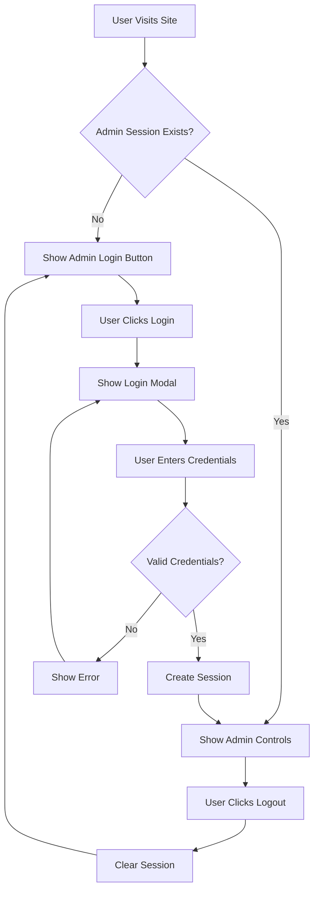

# Design Document - Admin & Developer Features

## Overview

This design implements admin authentication and developer information display features for the DIU EEE Routine Manager. The solution uses session-based authentication to protect data management operations while keeping public features accessible to all users.

## Architecture

### Component Structure

```
Application
├── UI Layer
│   ├── Developer Info Button
│   ├── Developer Info Modal
│   ├── Admin Login Button
│   ├── Admin Login Modal
│   └── Admin Logout Button
├── Authentication Layer
│   ├── Credential Validation
│   ├── Session Management
│   └── Access Control
└── Data Layer (existing)
    ├── Routine Data
    ├── Teacher Data
    └── Course Title Data
```

### Authentication Flow



## Components and Interfaces

### 1. Developer Info Component

**HTML Structure:**
```html
<!-- Button in header -->
<button class="btn btn-sm" id="btnDeveloperInfo">👨‍💻 Developer</button>

<!-- Modal -->
<div class="modal-overlay hidden" id="developerModal">
    <div class="modal developer-modal">
        <div class="modal-header">
            <h3>Developer Information</h3>
            <button class="close-btn">×</button>
        </div>
        <div class="modal-body">
            <div class="developer-card">
                
                <h4 class="developer-name">Sheikh Miraz Uddin Badsha</h4>
                <p class="developer-batch">Batch: 221(37), EEE Department</p>
                <p class="developer-university">Daffodil International University</p>
                <div class="developer-links">
                    <a href="https://www.linkedin.com/in/sheikh-miraz-uddin-badsha-b813621b4" target="_blank">
                        <span class="icon">🔗</span> LinkedIn
                    </a>
                    <a href="mailto:badsha33-1686@diu.edu.bd">
                        <span class="icon">📧</span> Email
                    </a>
                </div>
            </div>
        </div>
    </div>
</div>
```

**CSS Styling:**
```css
.developer-card {
    text-align: center;
    padding: var(--spacing-lg);
}

.developer-photo {
    width: 120px;
    height: 120px;
    border-radius: 50%;
    object-fit: cover;
    border: 3px solid var(--accent-cyan);
    margin-bottom: var(--spacing-md);
}

.developer-name {
    font-size: 20px;
    font-weight: 700;
    color: var(--accent-cyan);
    margin-bottom: var(--spacing-xs);
}

.developer-batch,
.developer-university {
    color: var(--text-secondary);
    font-size: 14px;
    margin-bottom: var(--spacing-xs);
}

.developer-links {
    display: flex;
    gap: var(--spacing-md);
    justify-content: center;
    margin-top: var(--spacing-lg);
}

.developer-links a {
    display: flex;
    align-items: center;
    gap: var(--spacing-xs);
    padding: var(--spacing-sm) var(--spacing-md);
    background: var(--surface-secondary);
    border: 1px solid var(--border-primary);
    border-radius: var(--radius-md);
    color: var(--text-primary);
    text-decoration: none;
    transition: all 0.2s ease;
}

.developer-links a:hover {
    border-color: var(--accent-cyan);
    background: var(--surface-tertiary);
}
```

### 2. Admin Authentication Component

**Data Model:**
```javascript
const ADMIN_CREDENTIALS = {
    email: 'admin@diu.edu.bd',  // Can be customized
    password: 'admin123'         // Should be changed in production
};

const AUTH_SESSION_KEY = 'diu_eee_admin_session';
```

**Session Management:**
```javascript
// Check if admin is logged in
function isAdminLoggedIn() {
    const session = sessionStorage.getItem(AUTH_SESSION_KEY);
    if (!session) return false;
    
    try {
        const data = JSON.parse(session);
        // Check if session is still valid (within 30 minutes)
        const now = Date.now();
        const sessionAge = now - data.timestamp;
        const thirtyMinutes = 30 * 60 * 1000;
        
        if (sessionAge > thirtyMinutes) {
            sessionStorage.removeItem(AUTH_SESSION_KEY);
            return false;
        }
        
        return data.isAdmin === true;
    } catch (error) {
        return false;
    }
}

// Create admin session
function createAdminSession() {
    const sessionData = {
        isAdmin: true,
        timestamp: Date.now()
    };
    sessionStorage.setItem(AUTH_SESSION_KEY, JSON.stringify(sessionData));
}

// Clear admin session
function clearAdminSession() {
    sessionStorage.removeItem(AUTH_SESSION_KEY);
}

// Validate credentials
function validateAdminCredentials(email, password) {
    return email === ADMIN_CREDENTIALS.email && 
           password === ADMIN_CREDENTIALS.password;
}
```

**Login Modal HTML:**
```html
<div class="modal-overlay hidden" id="adminLoginModal">
    <div class="modal admin-login-modal">
        <div class="modal-header">
            <h3>Admin Login</h3>
            <button class="close-btn">×</button>
        </div>
        <div class="modal-body">
            <form id="adminLoginForm" class="admin-login-form">
                <div class="form-field">
                    <label>Email</label>
                    <input type="email" id="adminEmail" required 
                           placeholder="admin@diu.edu.bd">
                </div>
                <div class="form-field">
                    <label>Password</label>
                    <input type="password" id="adminPassword" required 
                           placeholder="Enter password">
                </div>
                <div id="loginError" class="login-error hidden"></div>
            </form>
        </div>
        <div class="modal-footer">
            <button class="btn" id="cancelLogin">Cancel</button>
            <button class="btn btn-primary" id="confirmLogin">Login</button>
        </div>
    </div>
</div>
```

### 3. Access Control System

**UI Control Function:**
```javascript
function updateUIForAuthState() {
    const isAdmin = isAdminLoggedIn();
    
    // Admin-only buttons
    const adminOnlyElements = [
        '#fileExcel',
        '#fileTeacher', 
        '#fileCourseTitle',
        '#fileJSON',
        '#btnAddRow',
        '#btnClearAll',
        '#btnBackupJSON'
    ];
    
    adminOnlyElements.forEach(selector => {
        const element = $(selector);
        const label = element?.previousElementSibling;
        
        if (isAdmin) {
            element?.classList.remove('hidden');
            label?.classList.remove('hidden');
        } else {
            element?.classList.add('hidden');
            label?.classList.add('hidden');
        }
    });
    
    // Show/hide login/logout buttons
    const loginBtn = $('#btnAdminLogin');
    const logoutBtn = $('#btnAdminLogout');
    
    if (isAdmin) {
        loginBtn?.classList.add('hidden');
        logoutBtn?.classList.remove('hidden');
    } else {
        loginBtn?.classList.remove('hidden');
        logoutBtn?.classList.add('hidden');
    }
    
    // Public elements (always visible)
    // - Filters
    // - Table
    // - Export buttons
    // - Developer info button
}
```

## Data Models

### Session Data Structure

```typescript
interface AdminSession {
    isAdmin: boolean;
    timestamp: number;  // Unix timestamp in milliseconds
}
```

### Developer Info Structure

```typescript
interface DeveloperInfo {
    name: string;
    batch: string;
    department: string;
    university: string;
    linkedin: string;
    email: string;
    photo: string;  // File path
}
```

## Error Handling

### Login Errors

1. **Invalid Credentials**: Display "Invalid email or password" message
2. **Empty Fields**: HTML5 validation prevents submission
3. **Network Errors**: Not applicable (client-side only)

### Session Errors

1. **Expired Session**: Automatically log out and show login button
2. **Corrupted Session Data**: Clear session and require re-login
3. **Missing Session**: Treat as logged out

## Testing Strategy

### Unit Tests (Manual)

1. **Developer Info Modal**
   - Click button opens modal
   - Close button closes modal
   - Click outside closes modal
   - All links work correctly
   - Photo loads correctly
   - Responsive on mobile

2. **Admin Login**
   - Valid credentials create session
   - Invalid credentials show error
   - Empty fields prevent submission
   - Session persists on refresh
   - Session clears on logout

3. **Access Control**
   - Admin controls hidden when logged out
   - Admin controls visible when logged in
   - Public features always accessible
   - Session expires after 30 minutes

### Integration Tests

1. **Full Authentication Flow**
   - Login → Access admin features → Logout → Features hidden
   - Login → Refresh page → Still logged in
   - Login → Wait 30 min → Auto logout

2. **Cross-Feature Testing**
   - Import data while logged in
   - Export data while logged out
   - Filter data in both states

## Security Considerations

### Current Implementation

- **Session-based auth**: Uses sessionStorage (cleared on tab close)
- **No persistent storage**: Credentials not stored in localStorage
- **Client-side only**: No server-side validation (acceptable for single-user app)

### Limitations

- Credentials visible in source code (acceptable for demo/personal use)
- No encryption (acceptable for non-sensitive data)
- No rate limiting (could add if needed)

### Future Enhancements

- Hash passwords before storing
- Add CAPTCHA for login
- Implement rate limiting
- Add audit logging
- Multi-user support with backend

## Responsive Design

### Mobile Considerations

- Developer photo scales down on small screens
- Login modal fits mobile viewport
- Buttons stack vertically on narrow screens
- Touch-friendly button sizes (minimum 44x44px)

### Breakpoints

- Desktop: > 768px (full layout)
- Tablet: 481px - 768px (adjusted spacing)
- Mobile: ≤ 480px (stacked layout)
